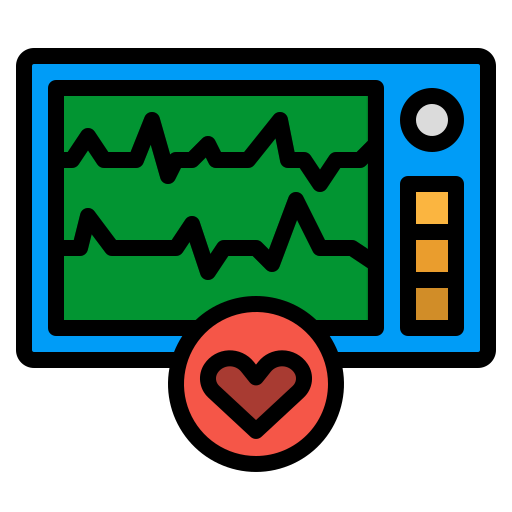
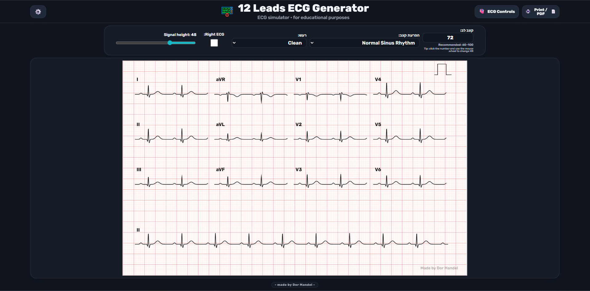
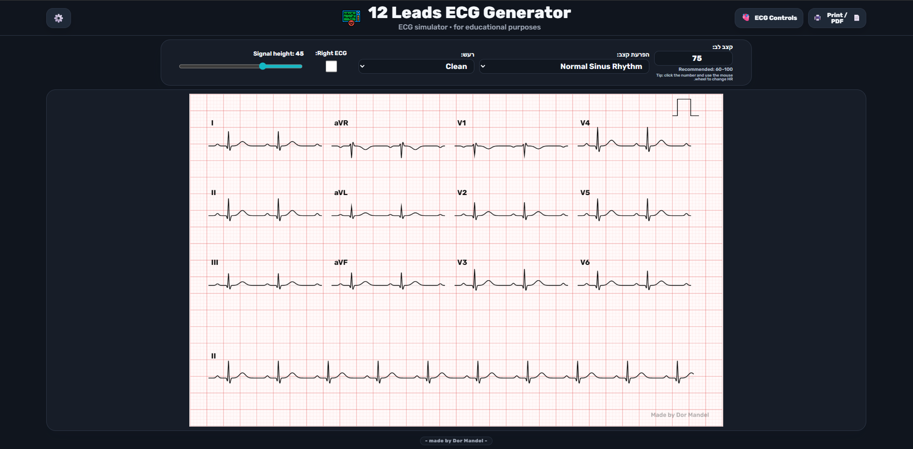
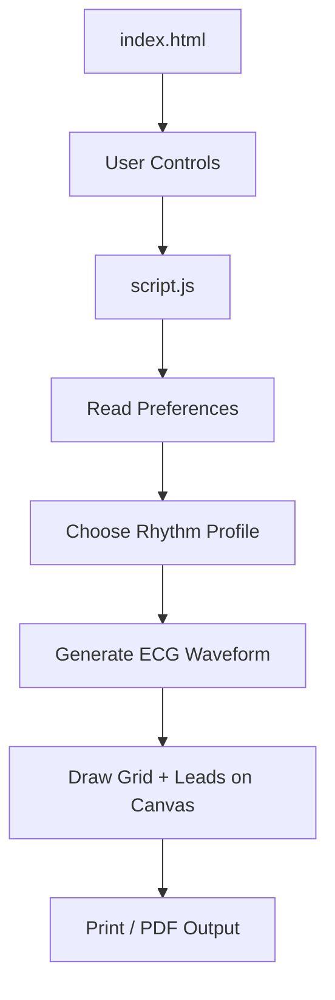
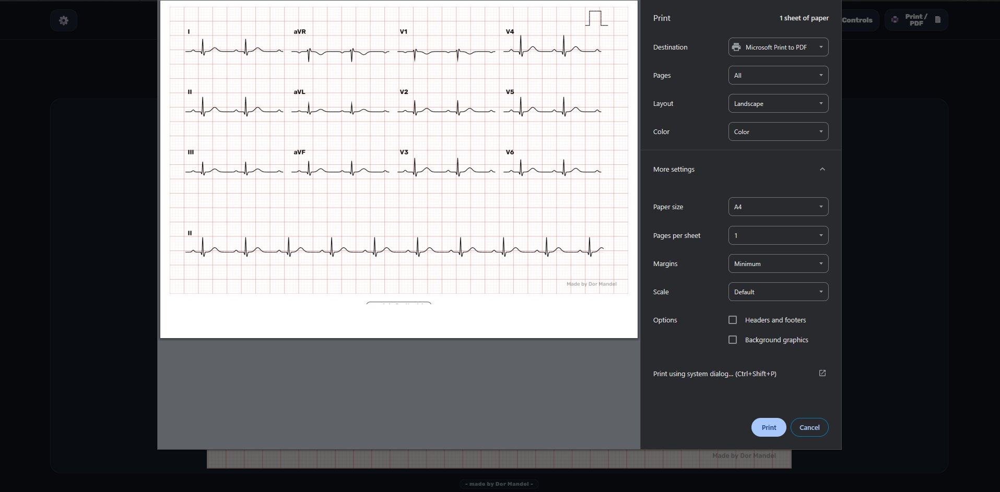
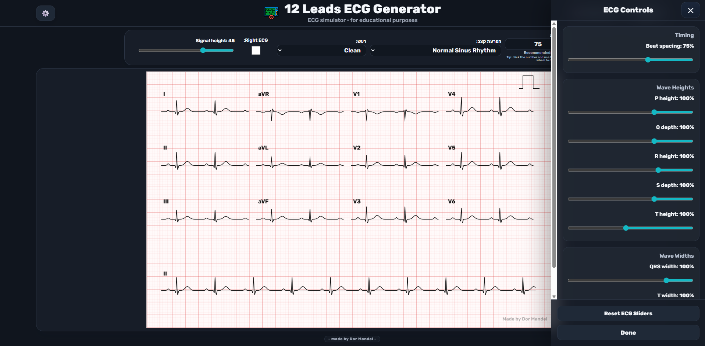

<div align="center">

# ECG 12 Lead Generator

<a href="https://dormandel.github.io/12-Lead-ECG-Generator-HTML/" target="_blank" rel="noopener noreferrer">
  
</a>

<br />

### Click the logo to open the live demo ⬆️

  ---

  **Educational 12-lead ECG simulator built with HTML, CSS, and JavaScript.**

  <br />

  [](https://dormandel.github.io/12-Lead-ECG-Generator-HTML/)
  
  
  

</div>

---

> [!WARNING]
> This project is for **educational and visual simulation purposes only**.  
> It is **not a medical device** and must **not** be used for diagnosis, treatment, monitoring, or clinical decision-making.

---


## Preview

<p align="center">
  
</p>

---

## Demo Video

<p align="center">
  <a href="assets/demo.mp4">
    
  </a>
</p>

<p align="center">
  <sub>Click the preview image to open the demo video.</sub>
</p>

<p align="center">
  <sub>Click the preview image to open the demo video.</sub>
</p>

---

## About The Project

**ECG 12 Lead Generator** is a browser-based simulator that generates an ECG-style printable sheet with a 12-lead layout.

The goal of the project is to create a clean, expandable, educational ECG generator that can later support more rhythm profiles, waveform modifiers, ECG conditions, and sample-based reference patterns.

The project is currently focused on:

- clean visual ECG rendering
- 12-lead layout
- rhythm profile selection
- live waveform controls
- print / PDF support
- local preference saving
- dark mode and page settings
- future ECG-condition expansion

---

## Features

| Feature | Status |
|---|---|
| 12-lead ECG layout | ✅ Working |
| Long Lead II rhythm strip | ✅ Working |
| Rhythm selection | ✅ Working |
| Heart rate control | ✅ Working |
| Noise control | ✅ Working |
| Right ECG labels | ✅ Working |
| ECG waveform drawer | ✅ Working |
| P / Q / R / S / T controls | ✅ Working |
| QRS and T width controls | ✅ Working |
| Page scale control | ✅ Working |
| Grid opacity control | ✅ Working |
| Dark mode | ✅ Working |
| Print / PDF | ✅ Working |
| Watermark | ✅ Working |
| LocalStorage preferences | ✅ Working |
| Real ECG sample matching | 🚧 Planned |
| Additive ECG anomalies | 🚧 Planned |
| Debug panel | 🚧 Planned |

---

## Current Rhythm Profiles

The simulator currently includes:

- Normal Sinus Rhythm
- Sinus Bradycardia
- Sinus Tachycardia
- Atrial Fibrillation
- PVC
- Hyperkalemia look
- Anterior STEMI look

More profiles are planned as the waveform engine becomes more realistic.

---

## ECG Controls

The project includes an ECG Controls drawer for live waveform tuning.

Current controls include:

| Control | Purpose |
|---|---|
| Beat spacing | Changes RR-like spacing visually |
| P height | Controls P wave height |
| Q depth | Controls Q wave depth |
| R height | Controls R wave height |
| S depth | Controls S wave depth |
| T height | Controls T wave height / inversion |
| QRS width | Controls QRS complex width |
| T width | Controls T wave width |

---

## Page Settings

The Page Settings drawer includes:

- dark mode
- ECG page scale
- grid opacity
- reset to default

Settings are saved locally in the browser using `localStorage`.

---

## How It Works



## Project Structure

```txt
12-Lead-ECG-Generator-HTML/
│
├── index.html
├── style.css
├── script.js
├── README.md
│
├── assets/
│   ├── icon-try.png
│   ├── favicon.svg
│   ├── preview.svg
│   ├── readme-hero.png
│   ├── readme-dark.png
│   ├── readme-controls.png
│   ├── demo-thumbnail.png
│   └── demo.mp4
│
├── data/
│   └── rhythm-profiles.js
│
└── js/
    ├── ecg-grid.js
    ├── ecg-leads.js
    ├── ecg-wave.js
    ├── ecg-rhythms.js
    ├── ecg-renderer.js
    └── ecg-print.js
```

Main Files
File	Responsibility
index.html	Page structure, controls, canvas, drawers, script loading
style.css	UI layout, dark mode, responsive design, print styling
script.js	Main app controller, preferences, events, ECG drawing
data/rhythm-profiles.js	Rhythm profile definitions
js/ecg-grid.js	ECG grid drawing logic
js/ecg-leads.js	Lead labels and lead modifiers
js/ecg-wave.js	Future waveform helpers
js/ecg-rhythms.js	Future rhythm helpers
js/ecg-renderer.js	Future render separation
js/ecg-print.js	Future print/PDF helpers
Roadmap
Near-term
 Clean and reorganize style.css
 Remove duplicate CSS patches
 Move waveform logic into smaller modules
 Add a debug panel
 Add paper speed controls
 Add gain controls
 Improve print layout
ECG realism
 Inferior MI
 LBBB
 RBBB
 LVH
 RVH
 WPW
 Prolonged QT
 AV blocks
 SVT
 Atrial flutter
 VT
 VF
 Asystole
 PVC patterns
Advanced ideas
 Additive ECG anomalies
 Combine rhythm + morphology modifiers
 Import real ECG reference samples
 Save custom presets
 Export as image
 Export as PDF
 Shareable preset links
Reference ECG Sample Roadmap

Planned reference categories include:

<details> <summary>Open ECG sample list</summary>

```
1. Sinus 120
2. Sinus 80
3. Sinus 50
4. Inferior MI 80
5. Inferior MI 80
6. Inferior MI 80
7. Anterior MI 80
8. Anterior MI 80
9. Anterior MI 80
10. Anterior MI late 80
11. LBBB 75
12. RBBB 100
13. LVH 90
14. WPW 70
15. WPW 100
16. Sinus + R.A.D 60
17. RVH 90
18. Prolong QT 70
19. 1° AV block 70
20. 2° AV block type 1 / Wenckebach 3:2 60
21. 2° AV block type 1 / Wenckebach 4:3 60
22. 2° AV block type 1 / Wenckebach 5:4 60
23. 2° AV block type 2 / Mobitz type 2
24. 2° AV block type 2
25. 2° AV block type 2
26. 3° Complete AV block
27. SVT 120
28. Atrial Tachycardia + Wandering Pacemaker
29. Atrial Flutter 4:1
30. Atrial Flutter 3:1
31. Atrial Flutter 2:1
32. Atrial Fibrillation
33. Atrial Fibrillation
34. Junctional Rhythm 60
35. Junctional Rhythm 150
36. Idioventricular
37. VT 140
38. VT 200
39. Torsades de Pointes
40. High Amplitude VF
41. Medium Amplitude VF
42. Low Amplitude VF / Fine VF
43. Asystole
44. Sinus 60 + Unifocal PVC
45. Sinus 60 + Coupled PVC
```

</details>

---

### Running Locally

#### Clone the repository:
```cmd
git clone https://github.com/DorManDel/12-Lead-ECG-Generator-HTML.git
cd 12-Lead-ECG-Generator-HTML
```

Open index.html directly, or use a local server such as the VS Code Live Server extension.

---

### Development Notes

This project is intentionally built with:

vanilla HTML
vanilla CSS
vanilla JavaScript
no framework
no build step

That keeps the project easy to understand, portable, and simple to host on GitHub Pages.

---

## Screenshots

Main view
<p align="center">  </p>
ECG controls drawer
<p align="center">  </p>
Dark mode
<p align="center">  </p>

---

#### License:
```
This project currently has no formal license.
```

<div align="center">

```
Made by Dor Mandel
```
</div> 
